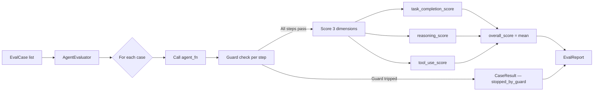
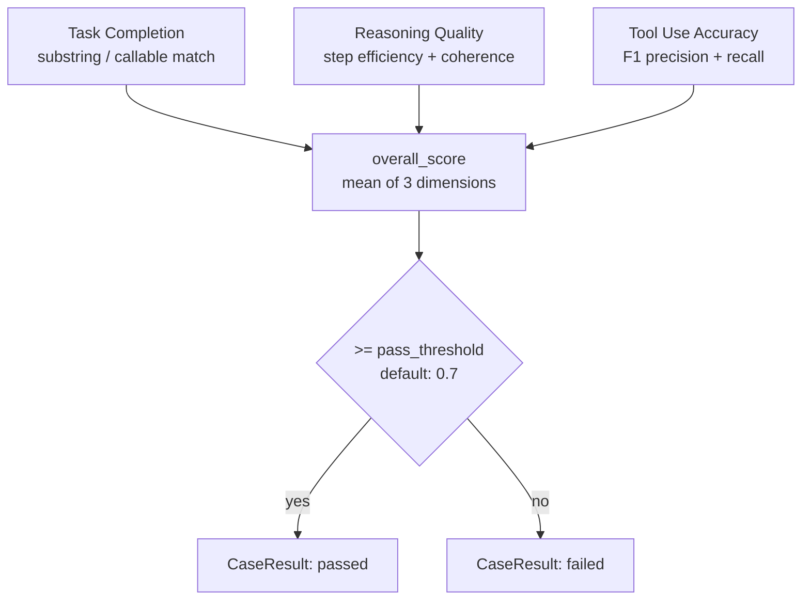

<div align="center">



# verdict

**You ship agents. Do you know if they work?**

[](https://pypi.org/project/agent-evals/)
[](https://pypi.org/project/agent-evals/)
[](LICENSE)
[](tests/)

*Production-grade evaluation framework for LLM agents.*<br>
*Score task completion, reasoning quality, and tool use accuracy — in a single run.*

</div>

---

## The Problem

You write an agent. Your unit tests pass. You ship it. Users report garbage.

- **Agents pass local tests but fail in production.** Mocks are not your agent. Eval cases are.
- **Impossible to know which dimension is failing.** Did it get the answer wrong, or did it reason its way there badly? Did it hallucinate a tool call? These are different bugs requiring different fixes.
- **No standard metric for agent quality.** "It worked in the demo" is not a number. Without a number, you cannot regress, compare, or improve.

`verdict` gives you a number. Three numbers, actually.

---

## Installation

```bash
pip install agent-evals
```

---

## Quickstart

```python
from agent_evals import AgentEvaluator, AgentResult, EvalCase, ReasoningStep, ToolCall

# Wrap your agent — any callable that returns AgentResult
def my_agent(prompt: str) -> AgentResult:
    # Replace this with your real agent
    return AgentResult(
        output="The capital of France is Paris.",
        reasoning_trace=[
            ReasoningStep(
                step_index=0,
                thought="This is a geography fact I can answer directly.",
                action="recall_knowledge",
                observation="Paris is France's capital — established fact.",
            )
        ],
        tool_calls=[],
        steps_taken=1,
        estimated_cost_usd=0.0001,
        model="gpt-4o-mini",
    )

evaluator = AgentEvaluator(agent_fn=my_agent)

report = evaluator.evaluate([
    EvalCase(
        id="geo-1",
        prompt="What is the capital of France?",
        expected_output="Paris",
    ),
    EvalCase(
        id="calc-1",
        prompt="Calculate compound interest: $1,000 at 5% annual for 10 years.",
        expected_output="1628.89",
        expected_tools=["calculator"],
    ),
    EvalCase(
        id="reason-1",
        prompt="A bat and ball cost $1.10. The bat costs $1 more than the ball. How much does the ball cost?",
        expected_output="0.05",
        metadata={"difficulty": "cognitive_bias", "category": "reasoning"},
    ),
])

print(report.summary())
```

**Output:**

```
EvalReport [run-abc123]  2025-01-15T14:23:11Z
  Model          : gpt-4o-mini
  Cases          : 3  (passed: 2, threshold: 0.7)
  Task completion: 0.867
  Reasoning      : 0.761
  Tool use       : 0.890
  Overall        : 0.839
  Total cost     : $0.0014
```

---

## The Three Dimensions

Every `EvalCase` produces three independent scores in `[0.0, 1.0]`.

### 1. Task Completion — *Did the agent answer correctly?*

```python
EvalCase(
    id="factual-1",
    prompt="What is the boiling point of water at sea level?",
    expected_output="100",          # substring match, case-insensitive
)

# Or provide a custom checker:
EvalCase(
    id="json-output",
    prompt="Return a JSON object with keys name and age.",
    expected_output=lambda s: '"name"' in s and '"age"' in s,
)
```

Scoring: exact substring match → 1.0 · no match → 0.0 · callable → callable result

### 2. Reasoning Quality — *Was the agent's thinking coherent and efficient?*

```python
AgentResult(
    output="$1,628.89",
    reasoning_trace=[
        ReasoningStep(
            step_index=0,
            thought="Apply A = P(1 + r)^t with P=1000, r=0.05, t=10",
            action="call_tool:calculator",
            observation="Calculator returned 1628.8946...",
        ),
        ReasoningStep(
            step_index=1,
            thought="Round to 2 decimal places for currency.",
            action="format_response",
            observation="Response formatted.",
        ),
    ],
    ...
)
```

Scoring factors: number of reasoning steps taken vs steps needed · logical coherence of thought→action→observation chains · loop detection (repeated actions penalised)

### 3. Tool Use Accuracy — *Did the agent call the right tools, correctly?*

```python
EvalCase(
    id="search-and-summarise",
    prompt="Find the current price of AAPL and summarise the last 5 news headlines.",
    expected_tools=["web_search", "summarise"],   # order-insensitive
)

# In your AgentResult:
AgentResult(
    ...
    tool_calls=[
        ToolCall(name="web_search", arguments={"query": "AAPL stock price"}, result="$182.40", latency_ms=340),
        ToolCall(name="summarise",  arguments={"text": "..."}, result="...", latency_ms=120),
    ],
)
```

Scoring: F1 of (expected tools called) × precision/recall · each failed tool call (`ToolCall.error` set) deducts 0.1, capped at 0.5 penalty

---

## EvalReport API

```python
report = evaluator.evaluate(cases)

# Aggregate metrics
report.mean_task_completion   # float [0, 1]
report.mean_reasoning         # float [0, 1]
report.mean_tool_use          # float [0, 1]
report.mean_overall           # float [0, 1]
report.total_cases            # int
report.passed_cases           # int — cases where overall_score >= pass_threshold
report.total_cost_usd         # float

# Per-case drill-down
for result in report.results:
    print(result.case_id, result.task_completion_score, result.tool_use_score)
    if result.stopped_by_guard:
        print(f"  ⚠ guard tripped: {result.stopped_by_guard}")
    if result.error:
        print(f"  ✗ error: {result.error}")

# Export
import json
with open("eval_report.json", "w") as f:
    json.dump(report.to_dict(), f, indent=2)

# Human-readable summary
print(report.summary())
```

---

## Production Guards

Guards protect your eval runs from runaway agents, infinite loops, and cost blowouts. They fire between every agent step.

```python
from agent_evals import AgentEvaluator, default_guards
from agent_evals import MaxStepsGuard, CostCeilingGuard, LoopDetectionGuard, CompositeGuard

# Sensible defaults for production
evaluator = AgentEvaluator(
    agent_fn=my_agent,
    guard=default_guards(max_steps=50, cost_ceiling=1.0),
)

# Or compose your own:
evaluator = AgentEvaluator(
    agent_fn=my_agent,
    guard=CompositeGuard([
        MaxStepsGuard(max_steps=30),          # Hard cap on steps
        CostCeilingGuard(ceiling_usd=0.25),   # Per-case cost limit
        LoopDetectionGuard(max_repeats=3),    # Kill repeated actions
    ]),
)
```

When a guard trips, the case is marked `stopped_by_guard` in `CaseResult` — your eval run continues with the remaining cases.

---

## Evaluation Pipeline



---

## Score Aggregation



---

## Integration: sentinel + herald

`verdict` is part of a cohesive agent infrastructure stack:

| Package | Role |
|---|---|
| **verdict** | Evaluate agents — measure quality across 3 dimensions |
| **sentinel** | Guard production runs — `MaxStepsGuard`, `CostCeilingGuard`, `LoopDetectionGuard` at runtime |
| **herald** | Structured logging and alerting — emit eval results to dashboards, Slack, PagerDuty |

```python
# Full stack: evaluate → guard → observe
from agent_evals import AgentEvaluator, default_guards, EvalCase

# Run evals in CI
evaluator = AgentEvaluator(agent_fn=my_agent, guard=default_guards())
report = evaluator.evaluate(regression_suite)

# Fail CI if quality drops
assert report.mean_overall >= 0.75, f"Quality regression: {report.mean_overall:.3f}"
assert report.mean_tool_use >= 0.80, f"Tool use regression: {report.mean_tool_use:.3f}"

# Export for herald
import json
with open("artifacts/eval_report.json", "w") as f:
    json.dump(report.to_dict(), f, indent=2)
```

---

## Data Models at a Glance

```python
@dataclass
class EvalCase:
    id: str
    prompt: str
    expected_output: str | Callable | None = None
    expected_tools: list[str] = field(default_factory=list)
    max_tokens: int = 2048
    metadata: dict = field(default_factory=dict)

@dataclass
class AgentResult:
    output: str
    reasoning_trace: list[ReasoningStep] = ...
    tool_calls: list[ToolCall] = ...
    steps_taken: int = 0
    estimated_cost_usd: float = 0.0
    model: str = ""

@dataclass
class CaseResult:
    case_id: str
    task_completion_score: float   # [0, 1]
    reasoning_score: float         # [0, 1]
    tool_use_score: float          # [0, 1]
    overall_score: float           # mean of above
    steps_taken: int
    estimated_cost_usd: float
    latency_ms: float
    stopped_by_guard: str | None
    error: str | None
```

---

## Philosophy

> **Dharma is not just action — it is correct action.**
>
> *verdict* measures whether your agent acted correctly.

An agent that produces the right answer through wrong reasoning is a liability. An agent that calls tools accurately but reasons in circles will fail at scale. True quality is three-dimensional: completion, reasoning, precision.

Shipping agents without evaluation is not speed — it is technical debt you cannot measure.

---

## Contributing

See [CONTRIBUTING.md](CONTRIBUTING.md). Run the test suite:

```bash
pip install -e ".[dev]"
pytest tests/ -v
```

---

<div align="center">
<sub>Built by <a href="https://github.com/darshjme">Darshankumar Joshi</a> · MIT License</sub>
</div>
