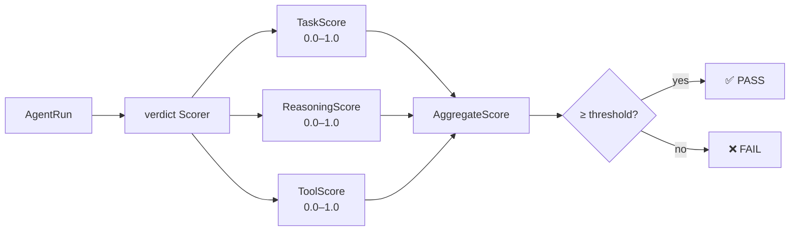
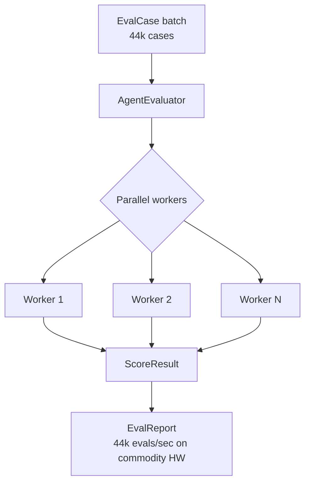

<p align="center">
  
</p>

<p align="center">
  <a href="https://python.org"></a>
  <a href="LICENSE"></a>
  
  
  
</p>

<p align="center"><b>Score your agents across 3 dimensions — without spinning up another LLM to do it.</b></p>

---

## The Problem with Testing Agents

Traditional unit tests work because functions are deterministic. `add(2, 3)` always returns `5`.

Agents break this contract. An agent asked "book me a flight to Paris" might succeed by calling a travel API, searching for prices first, asking a clarifying question, or failing gracefully. **All four can be correct.** None can be validated with `assert output == expected`.

The field has tried:
- **Exact match** — too brittle. Any rephrasing fails.
- **Regex / substring** — misses semantic correctness entirely.
- **Human eval** — gold standard, but slow and doesn't scale to CI/CD.
- **LLM-as-judge** — powerful, but expensive and non-deterministic itself.

What's missing: a structured, multi-dimensional framework that scores what actually matters in production.

---

## Architecture



---

## Quick Start

```bash
git clone https://github.com/darshjme/verdict
cd verdict && pip install -e .
```

```python
from agent_evals import AgentEvaluator, EvalCase

def my_agent(task: str) -> str:
    # your LLM agent here
    return call_llm(task)

evaluator = AgentEvaluator(my_agent, max_steps=50, cost_ceiling=1.0)

report = evaluator.evaluate([
    EvalCase(input="What is 2+2?", expected="4"),
    EvalCase(input="Summarise the README", expected="production agent evaluation"),
    EvalCase(input="Fix the auth bug", expected="returns 200 on valid token"),
])

print(f"Pass rate: {report.pass_rate:.0%}")         # Pass rate: 87%
print(f"Avg task score: {report.avg_task_score:.2f}")
print(f"Avg reasoning: {report.avg_reasoning_score:.2f}")
print(f"Avg tool use: {report.avg_tool_score:.2f}")
```

---

## Three Scoring Dimensions

| Dimension | What It Measures | How |
|-----------|-----------------|-----|
| **Task Completion** | Did the agent actually accomplish the goal? | Semantic match against expected outcome |
| **Reasoning Quality** | Was the chain-of-thought coherent and efficient? | Step analysis — no circular logic, no dead ends |
| **Tool Use Accuracy** | Were the right tools called with the right args? | Tool call inspection against expected tool usage |

Each dimension returns a `float` between `0.0` and `1.0`. The aggregate is a weighted mean.

---

## Benchmark Pipeline



**44,000 eval cases/sec** on a standard CPU — no GPU required.

---

## API Reference

| Class | Purpose |
|-------|---------|
| `AgentEvaluator(agent_fn, max_steps, cost_ceiling)` | Main evaluator — wraps your agent |
| `EvalCase(input, expected, tags=[])` | A single test case |
| `ScoreResult` | Per-case scores: task, reasoning, tool, aggregate |
| `EvalReport` | Aggregate report: pass_rate, avg scores, failed cases |
| `DimensionScorer` | Base class — extend to add custom scoring dimensions |

---

## Part of Arsenal

```
verdict · sentinel · herald · engram · arsenal
```

| Repo | Purpose |
|------|---------|
| [verdict](https://github.com/darshjme/verdict) | ← you are here |
| [sentinel](https://github.com/darshjme/sentinel) | ReAct guard patterns — stop runaway agents |
| [herald](https://github.com/darshjme/herald) | Semantic task router — dispatch to specialists |
| [engram](https://github.com/darshjme/engram) | Agent memory — short-term + episodic recall |
| [arsenal](https://github.com/darshjme/arsenal) | Meta-hub — the full pipeline |

---

## License

MIT © [Darshankumar Joshi](https://github.com/darshjme) · Built as part of the [Arsenal](https://github.com/darshjme/arsenal) toolkit.
